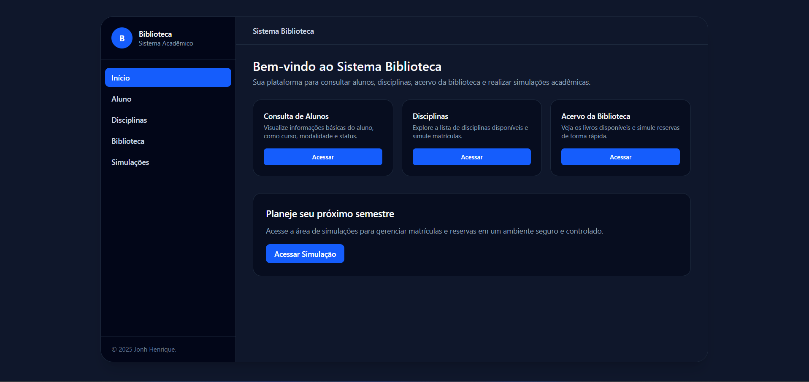
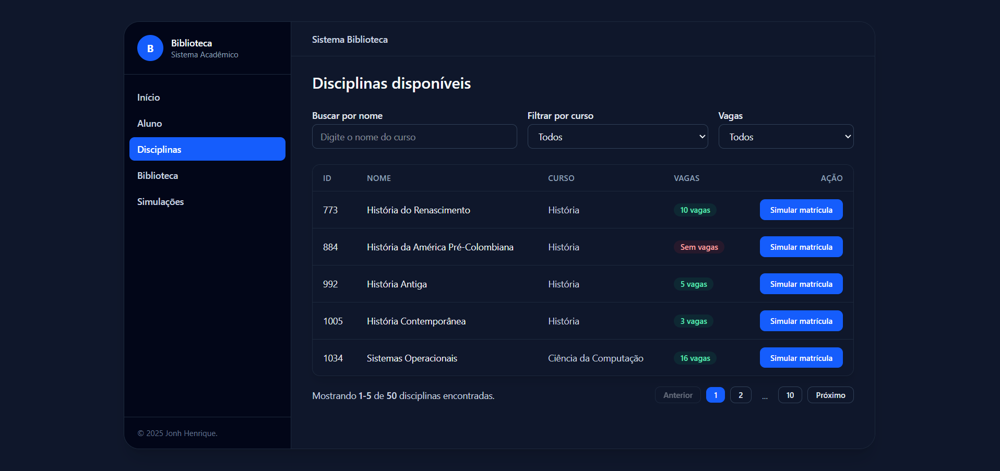
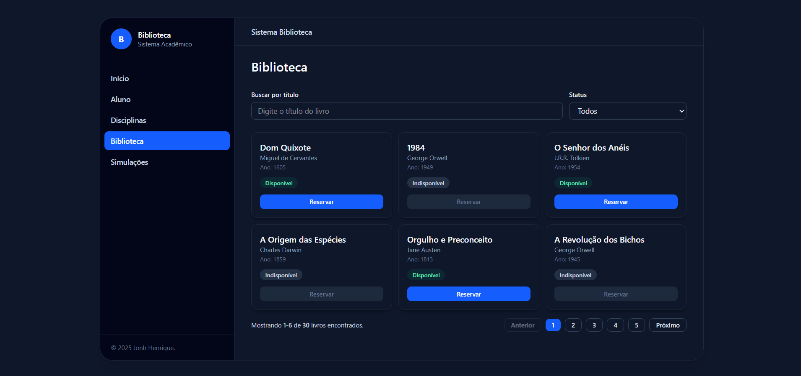
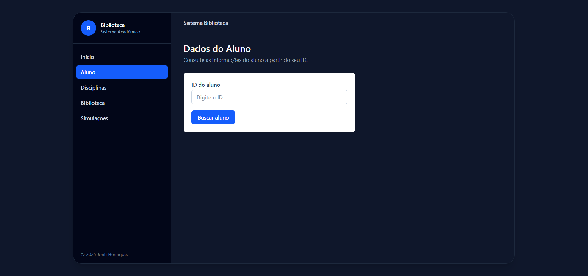
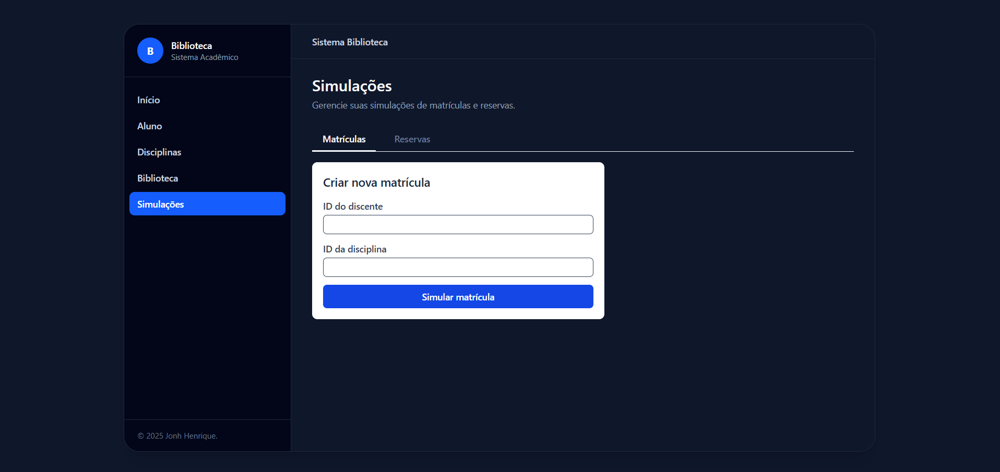

<p align="center">
  
</p>

<h1 align="center">📚 Sistema de Gerenciamento de Biblioteca Universitária</h1>

<p align="center">
  <em>Projeto Acadêmico — Desenvolvimento de Software</em><br/>
  <strong>Aplicação Full Stack (Backend + Frontend + Banco de Dados)</strong>
</p>

---

## 1. Nome do Projeto

**Sistema de Gerenciamento de Biblioteca Universitária**  
Aplicação Full Stack (Backend + Frontend + Banco de Dados)

---

## 2. Dados Institucionais

| Campo          | Informação                              |
| -------------- | --------------------------------------- |
| **Instituição**| Universidade de Fortaleza — UNIFOR      |
| **Curso**      | Ciência da Computação                   |
| **Disciplina** | Proj arquitetura de sistemas            |
| **Professor**  | Nathalino Pacheco                       |
| **Turma**      | T200-50                                 |
| **Ano/Semestre** | 2025.2                                |

---

## 3. Identificação do Autor

- **Aluno:** Jonh Henrique Moreira da Costa  
- **Matrícula:** 2420367  
- **E-mail acadêmico:** Moreirajonh2@gmail.com  

---


## 4. Descrição Geral do Projeto

O presente projeto foi desenvolvido com o objetivo de implementar um ** sistema monolito seguindo uma arquitetura de MVC de um Sistema de Gerenciamento de Biblioteca Universitária**, simulando um ambiente real de controle de acervo, usuários e circulação de materiais.

A aplicação foi planejada utilizando **princípios modernos de Engenharia de Software**:

- Arquitetura em múltiplas camadas (4-Layer Architecture)
- Clean Architecture
- Ports & Adapters
- Princípios SOLID
- Padrões GRASP
- Padrão MVC para organização do backend

O sistema foi dividido em duas grandes partes:

### **Backend (Node.js + Express + PostgreSQL/Neon)**  
É responsável por:

- Manter a API REST  
- Processar lógica de negócio  
- Sincronizar dados com APIs externas  
- Gerenciar o banco de dados  
- Implementar casos de uso seguindo Clean Architecture  
- Garantir integridade e coerência dos dados  
- Aplicar separação rigorosa entre Domínio, Aplicação e Infraestrutura  

### **Frontend (React + Vite + Tailwind)**  
É responsável por:

- Exibir as telas (Home, Disciplinas, Acervo, Aluno e Simulações)  
- Consumir a API backend  
- Filtrar e organizar dados dinamicamente  
- Criar uma experiência limpa, rápida e responsiva  
- Oferecer navegação intuitiva entre as funcionalidades  

Além disso, a estrutura prioriza:

- Baixo acoplamento
- Testabilidade
- Manutenibilidade
- Evolução futura
- Modularidade clara entre camadas

Este documento atua como **relatório técnico**, descrevendo todo o funcionamento do projeto, suas tecnologias, arquitetura interna e instruções de uso.

---

# 5. Objetivos do Sistema

## 5.1 Objetivo Geral

Desenvolver uma aplicação web completa para gerenciamento de biblioteca universitária, utilizando arquitetura escalável e tecnologias modernas de desenvolvimento web.

## 5.2 Objetivos Específicos

- Criar uma API documentada, organizada e intuitiva.
- Implementar um front-end limpo, responsivo e com boa experiência de usuário.
- Separar responsabilidades em camadas de forma clara e prática.
- Garantir a integridade dos dados por meio de um banco relacional.
- Reduzir o tempo de resposta da API para menos de 500 ms.
- Implementar padrões arquiteturais amplamente utilizados no mercado.
- Criar uma aplicação modular para fácil manutenção e expansão.
- Documentar completamente o ambiente de execução e implantação.

---

# 6. Tecnologias Utilizadas

### **Frontend**
<p>
  
  
  
</p>

### **Backend**
<p>
  
  
  
</p>

### **Banco de Dados**
<p>
  
  
</p>

---

## 6.2 Descrição das Tecnologias

### **React.js**
Biblioteca JavaScript focada em interfaces de usuário, baseada em componentes reutilizáveis.

### **Vite**
Build tool ultrarrápida, melhorando o fluxo de desenvolvimento.

### **Tailwind CSS**
Framework baseado em utilitários para estilização moderna e responsiva.

### **Node.js & Express**
Ambiente de execução e framework para APIs REST.

### **PostgreSQL & Neon**
Banco de dados relacional robusto e versão cloud escalável.

---

# 7. Dificuldades Encontradas

Durante o processo de desenvolvimento, várias dificuldades foram enfrentadas:

### **1. Alto tempo de resposta da API**
Problema: Sincronização de dados levando mais de **3 segundos**.  
Solução: Reestruturação da lógica, caching, otimização de consultas.  
Resultado: **~400 ms**.

### **2. Conflitos de arquitetura**
Problema: Camadas misturadas e acoplamento excessivo.  
Solução: Reescrita da estrutura seguindo Ports & Adapters.

### **3. Integração Frontend ↔ Backend**
Problema: Erros de CORS, rotas inconsistentes e responses inválidas.  
Solução: Padronização de services e DTOs.

---

# 8. Como Executar o Projeto

## **Backend**

```bash
cd backend
npm install
npm run dev
```
## **Frontend**

```bash
cd frontend
npm install
npm run dev
```
---

# 9. Modelo do Arquivo `.env`

Abaixo segue o modelo base que deve ser utilizado para o correto funcionamento do backend.  
Este arquivo contém as variáveis sensíveis essenciais para a aplicação, como URL do banco de dados e porta de execução.

```env
PORT= // PORTA DESEJADA

ALUNO_API_BASE_URL=
DISCIPLINA_API_BASE_URL=
BIBLIOTECA_API_BASE_URL=

DATABASE_URL= // link do seu banco de dados
DB_SSL= // true

```

---

# 10. Explicação da Arquitetura (Visão Teórica)

Este projeto segue um conjunto robusto de práticas de Engenharia de Software, combinando padrões arquiteturais amplamente utilizados na indústria.  
A arquitetura foi projetada para garantir:

- Baixo acoplamento  
- Alta coesão  
- Escalabilidade  
- Facilidade de manutenção  
- Domínio isolado  
- Independência de tecnologia  

As principais abordagens utilizadas foram:

- **4-Layer Architecture**
- **Clean Architecture**
- **Ports & Adapters (Arquitetura Hexagonal)**
- **MVC aplicado no backend**
- **Domínio rico com entidades e value objects**

A seguir, é apresentada a explicação completa de cada camada.

---

## 10.1 Camadas Principais da Arquitetura

### **1. Presentation Layer (Camada de Apresentação)**  
Camada de entrada do sistema.  
Responsável por:

- Receber requisições HTTP  
- Validar dados enviados pelo usuário  
- Converter input em DTOs  
- Chamar os casos de uso apropriados  
- Retornar respostas padronizadas  

Não contém lógica de domínio.

---

### **2. Application Layer (Camada de Aplicação / Use Cases)**  
Responsável por orquestrar fluxos da aplicação.  
Aqui ficam:

- Regras de aplicação  
- Execução sequencial de operações  
- Atores e serviços que compõem o fluxo de uma ação  

Ela sabe *o que fazer*, mas não sabe *como persistir* ou *de onde vêm os dados*.

---

### **3. Domain Layer (Camada de Domínio)**  
Coração do sistema, completamente independente.

Contém:

- Entidades  
- Objetos de Valor (Value Objects)  
- Regras de negócio puras  
- Serviços de domínio  
- Exceções de domínio  
- Contratos de interfaces (Ports)  

Essa camada não depende de nenhuma tecnologia.

---

### **4. Infrastructure Layer (Camada de Infraestrutura)**  
Implementa o "mundo real", incluindo:

- Banco de dados PostgreSQL / Neon  
- Repositórios concretos  
- Serviços HTTP externos  
- Adapters  
- Arquivos de configuração  
- Módulos auxiliares  

É a camada com mais mudanças ao longo do tempo, e a arquitetura foi projetada para que tais mudanças **não afetem o domínio**.

---

## 10.2 Ports & Adapters

### **Ports**
Descrevem *o que o domínio espera*, por exemplo:

- `ILivroRepository`
- `IClienteRepository`
- `IReservaRepository`

Eles são contratos independentes de tecnologia.

---

### **Adapters**
Implementações concretas dos ports.  
Exemplo:

- `PostgresLivroRepository` implementa `ILivroRepository`

Isso permite trocar o banco, API externa ou serviço sem alterar o restante da aplicação.

---

# 11. Arquitetura do Backend — Explicação Completa

A arquitetura do backend segue rigorosamente os padrões definidos.  
Abaixo está a estrutura final, já formatada conforme solicitado:

```text
/backend
 ├── src
 │   ├── app/                 # Inicialização do servidor, rotas e middlewares globais
 │   ├── core/                # Regras de negócio (domínio puro)
 │   │   ├── domain/          # Entidades, value objects, erros e serviços de domínio
 │   │   ├── ports/           # Interfaces (contratos) do domínio
 │   │   └── usecases/        # Casos de uso: operações do sistema
 │   ├── infra/               # Infraestrutura: banco de dados, repositórios concretos
 │   │   ├── db/              # Conexão com PostgreSQL / Neon
 │   │   ├── http/            # Serviços HTTP externos (se houver)
 │   │   └── repositories/    # Implementações dos repositórios
 │   ├── adapters/            # Controladores, mapeadores e DTOs
 │   │   ├── controllers/     # Controllers das rotas HTTP
 │   │   ├── dtos/            # Objetos de transferência de dados
 │   │   └── mappers/         # Conversão entre entidades e JSON
 │   ├── shared/              # Ferramentas auxiliares
 │   │   ├── errors/          # Tratamento unificado de erros
 │   │   ├── logging/         # Logs da aplicação
 │   │   └── middleware/      # Middlewares reutilizáveis
 │   └── config/              # Variáveis de ambiente e configurações do app
 │
 └── .env

 /frontend
  ├── src
  │   ├── pages/               # Páginas completas: Login, Dashboard, Livros, etc.
  │   ├── components/          # Tabelas, botões, modais, formulários reutilizáveis
  │   ├── services/            # Requisições (API) organizadas por módulos
  │   ├── routes.jsx           # Gerenciamento de rotas com React Router
  │   ├── assets/              # Imagens do sistema (telas, logos, ícones)
  │   └── styles/              # Estilos globais e configs do Tailwind
  │
  └── index.html               # HTML raiz servido pelo Vite
 ```

 ---

---

## 12.1 Páginas da Aplicação

A seguir são apresentadas as principais páginas da aplicação, com uma breve descrição de suas responsabilidades e o espaço reservado para as respectivas capturas de tela.

---

### 12.1.1 HomePage.jsx — Página Inicial

<p align="center">
  
</p>

A **HomePage** funciona como ponto de entrada da aplicação.  
Nela o usuário tem uma visão geral do sistema, com:

- Acesso rápido às principais funcionalidades (Disciplinas, Acervo, Alunos, Simulações)  
- Contextualização do propósito da aplicação  
- Uma navegação clara para as demais páginas  

É a página responsável por orientar o fluxo inicial do usuário dentro do sistema.

---

### 12.1.2 DisciplinasPage.jsx — Consulta e Gestão de Disciplinas

<p align="center">
  
</p>

A página **Disciplinas** é dedicada à visualização das disciplinas ofertadas.  
Entre suas responsabilidades, destacam-se:

- Listar as disciplinas com informações como nome, curso e quantidade de vagas  
- Permitir filtragem por nome da disciplina e/ou por curso  
- Apresentar as vagas disponibilizadas, refletindo a informação sincronizada com a API externa e o banco de dados (cache)  
- Facilitar a análise da oferta de disciplinas para fins de simulação de matrícula  

Esta tela é crucial para que o aluno e o sistema possam trabalhar com dados consistentes de disciplinas.

---

### 12.1.3 AcervoPage.jsx — Consulta de Acervo

<p align="center">
  
</p>

A **AcervoPage** apresenta o acervo disponível dentro do contexto da aplicação (por exemplo, itens associados às disciplinas ou recursos acadêmicos).  

Suas principais funções incluem:

- Listar os itens do acervo com informações relevantes  
- Oferecer filtros para facilitar a localização de um item específico  
- Servir como base para consultas utilizadas em simulações ou tomadas de decisão  

A tela foi pensada para ser objetiva e de fácil leitura, permitindo rápida identificação dos itens disponíveis.

---

### 12.1.4 AlunoPage.jsx — Informações do Aluno

<p align="center">
  
</p>

A página **Aluno** concentra os dados do discente dentro do sistema.  

Responsabilidades típicas:

- Exibir informações do aluno (identificação, curso, matrícula, etc.)  
- Servir como base para simulações envolvendo aquele aluno  
- Possibilitar, conforme a implementação, ações relacionadas ao cadastro ou atualização de dados  

Ela funciona como o “perfil” ou contexto do aluno dentro da aplicação.

---

### 12.1.5 SimulacoesPage.jsx — Simulação de Matrícula

<p align="center">
  
</p>

A **SimulacoesPage** é responsável pela lógica de **simulação de matrícula** ou cenários similares.  

Entre suas funções, destacam-se:

- Permitir ao usuário selecionar disciplinas a partir dos dados carregados  
- Verificar disponibilidade de vagas nas disciplinas escolhidas  
- Registrar ou exibir o resultado de uma simulação (por exemplo, disciplinas em que o aluno conseguiria ou não se matricular)  
- Apoiar a tomada de decisão antes de um processo real de matrícula  

Essa tela materializa o objetivo principal do sistema: **analisar e simular cenários acadêmicos** com base nos dados de disciplinas, acervo e alunos.

---

# 14. Referências

A seguir estão as principais referências técnicas, acadêmicas e bibliográficas utilizadas durante o desenvolvimento deste projeto. Todas contribuíram de maneira significativa para as decisões arquiteturais, implementação e estruturação teórica da solução.

### **Documentações Técnicas Oficiais**

- **React.js** — https://react.dev  
- **Node.js** — https://nodejs.org  
- **Express.js** — https://expressjs.com  
- **PostgreSQL Documentation** — https://www.postgresql.org/docs/  
- **Neon Database** — https://neon.tech  
- **TailwindCSS** — https://tailwindcss.com/docs  
- **JavaScript (ES) Specification – MDN Web Docs**  
  https://developer.mozilla.org/en-US/docs/Web/JavaScript  

---

### **Livros, Artigos e Materiais Acadêmicos**

- **Gamma, E.; Helm, R.; Johnson, R.; Vlissides, J.**  
  *Design Patterns: Elements of Reusable Object-Oriented Software.*  
  Addison-Wesley, 1994.  
  (Obra fundamental para padrões de projeto, altamente utilizada nas decisões de arquitetura.)

- **Aniche, Mauricio.**  
  *Orientação a Objetos e SOLID para Ninjas: Projetando classes flexíveis.*  
  Editora Casa do Código, 2015.  
  (Referência usada para reforçar princípios SOLID e boas práticas de design orientado a objetos.)

- **Larman, Craig.**  
  *Utilizando UML e Padrões — Uma Introdução à Análise e ao Projeto Orientado a Objetos e ao Desenvolvimento Iterativo.*  
  3ª ed., Bookman, 2007.  
  (Base teórica para GRASP, UML e análise de requisitos.)

- **Richards, Mark; Ford, Neal.**  
  *Fundamentos da Arquitetura de Software: Uma Abordagem de Engenharia.*  
  Alta Books, 2024.  
  Disponível em: https://integrada.minhabiblioteca.com.br/books/9788550819754  
  Acesso em: 05 jan. 2024.  
  (Referência essencial para decisões arquiteturais e práticas de engenharia profissional.)

- **Sommerville, Ian.**  
  *Engenharia de Software.*  
  9ª ed., Pearson Prentice Hall, 2011.  
  (Base fundamental em engenharia de software, ciclo de vida e processos.)

- **Robert C. Martin (Uncle Bob).**  
  *Clean Architecture* e *Clean Code*.  
  (Referências práticas para separação de camadas, coesão, acoplamento e boas práticas de código limpo.)

- **Alistair Cockburn.**  
  *Ports and Adapters Architecture (Hexagonal Architecture).*  
  (Base conceitual utilizada para separar domínio e infraestrutura no projeto.)

---

# 14.1 Referências de Inteligência Artificial Utilizadas

Durante o desenvolvimento deste projeto, ferramentas de Inteligência Artificial foram utilizadas como suporte pedagógico e consultoria técnica, contribuindo para o entendimento de conceitos avançados, explicação de dúvidas, modelagem e aceleração da produtividade.

<p>
  
  
  
</p>

### **Stitch IA — Modelagem de UX Design**
- Auxílio na criação e organização das interfaces  
- Sugestões de padrões de layout  
- Melhoria na experiência do usuário  

### **ChatGPT — Apoio no Desenvolvimento Frontend e Backend**
- Ajuda na escrita de componentes React  
- Suporte à criação de serviços, rotas e controllers  
- Explicações de padrões arquiteturais e estrutura de camadas  
- Apoio na documentação (README, organização e formatação)  

### **Claude AI — Diagnóstico e Entendimento de Erros**
- Análise técnica de bugs complexos  
- Explicação de comportamentos inesperados  
- Suporte à compreensão do fluxo de dados e arquitetura  
- Auxílio na revisão lógica de casos de uso e repositórios  

Essas ferramentas foram usadas como **apoio ao aprendizado**, respeitando a autonomia intelectual e prática do discente.

---

# 15. Agradecimentos

Agradeço à **Universidade de Fortaleza — UNIFOR**, à coordenação acadêmica e ao professor **Nathalino Pacheco**, pela base sólida fornecida durante a disciplina e pela oportunidade de aplicar conceitos avançados de arquitetura de software em um projeto prático e realista.

Agradeço também à turma **T200-50**, cujo apoio e troca de conhecimentos foram essenciais durante o desenvolvimento.

Este projeto representa não apenas uma entrega acadêmica, mas também a consolidação do conhecimento adquirido ao longo do semestre, reforçando a importância do estudo contínuo, da prática e da pesquisa aplicada no desenvolvimento de soluções tecnológicas modernas.

---

 


